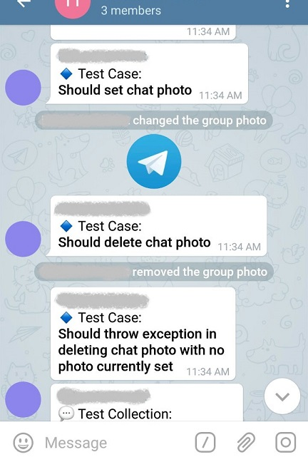
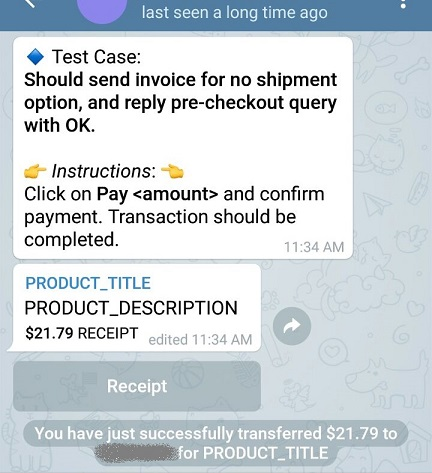

# Systems Integration Tests

Systems Integration tests are meant to test the project with real data from Telegram. They are semi-automated tests and tester(s) need to interact with bot for some cases during the test execution. Tests could be used as a playground for exploring Bot API methods.

## Sample Test Diagnostics Output

All the test output goes into supergroup, channel, and private chats specified in configurations or interactively during test execution. You can see some samples of test output below.

Admin bots can change chat photo.



Invoices could be paid in private chats.



## How Tests Works

These tests are written just like regular unit tests with xUnit framework so they seem to be unit tests. When you run test(s), bot makes a request to Bot API and you should see results(message or service notification) in the chat with bot.

When you build the solution, you will see them in Test Explorer window. Tests could be run through .NET Core's CLI as well and that's how this project's CI is set up.

A bot, of course, is needed to test Bot API. This document refers to its user name as _MyTestBot_.

_Tester_ refers to user name of person testing the bot. Multiple testers could interact with bot during
test execution. If super group chat has other members that are not listed as testers, bot ignores their
messages during test execution. Testers must have user names assigned and their user names should be set
in test configurations before hand.

All the tests happen in 3 kind of chats. Super Group, Channel, and a Private chat with one of the testers.

Test cases that need tester's interaction to continue, have a limit of usually 2 minutes to wait for receiving an expected update from API.

Tests could be run individually, in collections, or all at once. All the test collection and test cases within them are ordered and tests will not run in parallel.

## Test Environment Setup

Create a Super Group and a Channel. Add bot to them and promote bot to admin with all the permissions. The super group needs to have another regular(non-admin) member to be used in tests for chat administration methods(such as Kick, Restrict, Unban). A super group with 2 testers in it, one admin and the other non-admin member, is enough.

Bot should have some features enabled, usually through BotFather, in order to pass tests. These features are listed below:

- Inline Queries
- Payment Provider

For making testing process more convenient, set the following commands for MyTestBot as well. The purpose for these commands is explained in the sections below.

```text
test - Start test execution
  me - Select me for testing admin methods
```

## Test Configurations

You can see a list of configuration keys in `appsettings.json` file. Make a copy of this file and store your configurations there. In addition to `appsettings.json` and `appsettings.Development.json`, environment variables prefixed by `TelegramBot_` are also read into program.

```bash
cp appsettings.json appsettings.Development.json
```

### Required Settings

Only 2 values must be provided before test execution.

#### API Token

This is required for executing any test case.

```json
{
    "ApiToken": "MyTestBot-API-TOKEN"
    /* ... */
}
```

#### Allowed Users

A comma separated list indicating user name(s) of tester(s). Any update coming from users other than the ones listed here are discarded during test execution.

```json
{
    /* ... */
    "AllowedUserNames": "tester1, Tester2, TESTER3"
    /* ... */
}
```

### Optional Settings

The following settings are not required for two reasons. Either bot can ask for them during test execution or it is not a required setting for all test cases.

Bot will ask testers in supergroup/private chat for the necessary information. It would be faster to set all the optional settings as well because it makes testing process faster and less manual.

> For obtaining values of necessary settings, you can set breakpoints in some test methods and extract values such as chat id or user id.

#### Supergroup Chat Id

Bot send  messages to this chat in almost all test cases except cases like sending payments that must be to a private chat.

If not set, before starting any test method, bot waits for a tester to send it a `/test` command in a super group chat (that bot is also a member of).

```json
{
    /* ... */
    "SuperGroupChatId": -1234567890
    /* ... */
}
```

#### Channel Chat Id

Id of the private or public channel on which bot has admin rights.

If not set, before starting any test method, bot waits for a tester to send it a `/test` command in a channel chat (that bot is also a member of).

```json
{
    /* ... */
    "ChannelChatId": -1234567890
    /* ... */
}
```

#### Payment Settings

##### [Required] Payment Provider Token

This token is **required** for any test case regarding payments and must be provided before starting tests.

Consult Telegram API documentations and talk to BotFather to get a test token from a payment provider. An easy way to setup a test account might be using the [Stripe TEST Mode](https://core.telegram.org/bots/payments#testing-payments-the-stripe-test-mode-provider).

```json
{
    /* ... */
    "PaymentProviderToken": "MY-PAYMENT-PROVIDER-TOKEN"
    /* ... */
}
```

##### TesterPrivateChatId

Invoices could only be sent to private chats. If not set, bot will wait for a tester to send it `/test` command in a private chat.

```json
{
    /* ... */
    "TesterPrivateChatId": 1234567890
    /* ... */
}
```

#### Stickers

Sticker sets need to have an owner. Owner is usually the main tester in group that can then manage his/her sticker sets using `@Stickers` bot.

```json
{
    /* ... */
    "StickerOwnerUserId": 1234567890
    /* ... */
}
```

#### Chat Administration

For this type of tests, bot should be a privileged admin of that super group. Methods such as kick or unban will be performed on a regular (non-admin) tester in that chat.

If the following 3 settings are not set, bot will ask a tester to send it `/me` command in a private chat with bot.

- Regular Member's User Id
- Regular Member's User Name
- Regular Member's Private Chat Id

```json
{
    /* ... */
    "RegularMemberUserId": 1234567890,
    "RegularMemberUserName": "tester3",
    "RegularMemberPrivateChatId": 1234567890
    /* ... */
}
```
